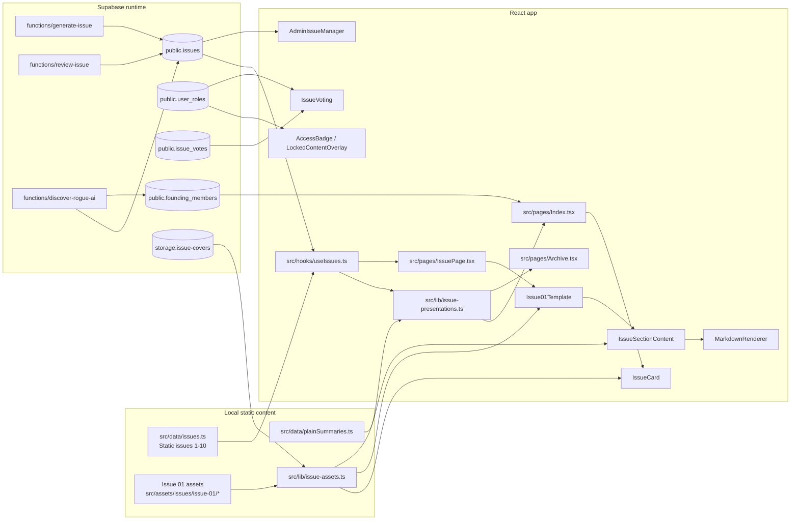

# Newsletter Content Architecture Discovery

## 1. Executive Summary

The current BLACKFILES content system is split across two sources of truth:

- Static issue content for issues 1-10 in `src/data/issues.ts`, plus helper summaries in `src/data/plainSummaries.ts`.
- Supabase-backed issue rows for issues 11+ via `src/hooks/useIssues.ts`, `supabase/migrations/*`, and the `issues` table in `src/integrations/supabase/types.ts`.

The approved homepage and Issue 01 reference implementation now sit on top of that split model. The homepage selects the latest published issue from the merged issue list, the archive renders the same merged list, and `src/pages/IssuePage.tsx` special-cases Issue 01 into `src/components/issues/Issue01Template.tsx` while retaining the legacy reader path for other issues.

The unified newsletter migration should preserve these facts:

- Issue numbers are the active routing key.
- Local static issues still override Supabase for issues 1-10.
- Issue 01 is now the canonical visual and structural reference.
- User state, membership, and votes are separate from canonical editorial content.
- Access control exists in the data model, but IssuePage currently does not enforce section locking for the legacy reader path.

This document records the current architecture and proposes a staged path toward a single canonical newsletter content model without changing visible behavior in the short term.

## 2. Current-State Architecture

### Editorial content

- `src/data/issues.ts`
  - Defines the `Issue`, `Section`, `IssueMedia`, and `AccessLevel` shapes.
  - Stores issues 1-10 as static in-memory editorial records.
  - Issue 01 is now rewritten as the synthetic identity fraud article.
  - Issues 2-10 remain legacy long-form content with mixed `public`, `professional`, and `restricted` sections.
- `src/data/plainSummaries.ts`
  - Contains hard-coded plain-English summaries for issues 1-10.
  - Falls back to a summary derived from executive summary text for dynamic issues.

### Presentation and routing

- `src/hooks/useIssues.ts`
  - `useAllIssues()` merges static issues with Supabase issues where `number > 10`.
  - `useIssue(issueNumber)` returns static issues for numbers `<= 10`; it only queries Supabase for `> 10`.
  - This means local static data is authoritative for 1-10.
- `src/pages/Index.tsx`
  - Uses `useAllIssues()` and `getLatestPublishedIssue()` from `src/lib/issue-presentations.ts`.
  - Renders the homepage from the merged issue list.
- `src/pages/Archive.tsx`
  - Uses `useAllIssues()` and filters by search, theme, and tags.
- `src/pages/IssuePage.tsx`
  - Resolves `:issueNumber` from the route.
  - Returns `Issue01Template` for issue number 1.
  - Uses the legacy issue reader layout for all other issues.
- `src/components/IssueCard.tsx`
  - Renders archive/homepage cards from the merged issue objects.
- `src/lib/issue-presentations.ts`
  - Selects latest published issue by publish date, then issue number.
  - Computes reading time and summary text.
- `src/components/issues/Issue01Template.tsx`
  - Canonical Issue 01 article layout.
  - Uses a table of contents, share links, read-next cards, and the shared asset resolver.
- `src/components/issues/IssueSectionContent.tsx`
  - Renders markdown content, sources, and issue media.
- `src/components/MarkdownRenderer.tsx`
  - Safe markdown renderer with links, bold, italics, inline code, lists, headings, and horizontal rules.

### Access control and user state

- `src/contexts/AuthContext.tsx`
  - Stores the current user, access level, admin status, and auth helpers.
  - Uses Supabase `user_roles` and the `access_level` enum.
- `src/components/AccessBadge.tsx`
  - Displays the current access tier.
- `src/components/LockedContentOverlay.tsx`
  - Shows a restricted-content fallback.
- `src/components/IssueVoting.tsx`
  - Reads/writes `issue_votes`.
- `src/hooks/useVoteCounts.ts`
  - Reads aggregate vote counts via RPC.
- `src/components/AdminIssueManager.tsx`
  - Manages issue rows in Supabase for the admin route.

### Assets

- `src/lib/issue-assets.ts`
  - Resolves cover aliases like `issue-01`, `issue-02`, etc. to imported asset files.
  - Exports Issue 01 supporting media assets.
- `src/assets/issues/issue-01/*`
  - Canonical Issue 01 cover and supporting SVGs.
- `src/assets/covers/*`
  - Legacy cover art for issues 2-11 and selected later issue artifacts.

### Supabase

- `supabase/migrations/*`
  - Define the `issues`, `issue_votes`, `user_roles`, `rogue_ai_incidents`, and `founding_members` tables plus access functions and RLS policies.
- `src/integrations/supabase/types.ts`
  - Generated TypeScript mirror of those tables, enums, and RPCs.
- `supabase/functions/generate-issue/index.ts`
  - Generates draft issue rows, cover images, and JSON issue sections.
- `supabase/functions/review-issue/index.ts`
  - Reviews drafts, revises sections, and can publish issues.
- `supabase/functions/discover-rogue-ai/index.ts`
  - Populates the rogue AI dossier.

## 3. Current Sources of Truth

### Canonical editorial content today

1. `src/data/issues.ts`
   - Static source of truth for issue numbers 1-10.
   - Includes the current Issue 01 content and the legacy issues 2-10.
2. `supabase/functions/generate-issue/index.ts`
   - Defines the JSON structure the generator expects for dynamic issue rows.
3. `supabase/migrations/20260205010202_5b69e853-3838-402b-a0fc-33047248fe55.sql`
   - Creates the `issues` table with `number`, `title`, `theme`, `cover_image`, `publication_status`, `publish_date`, `tags`, and JSONB `sections`.

### Presentation sources

1. `src/lib/issue-presentations.ts`
   - Latest issue and reading-time helpers.
2. `src/data/plainSummaries.ts`
   - Issue summaries and fallback summarization logic.
3. `src/components/IssueCard.tsx`
   - Archive/homepage card presentation.
4. `src/components/issues/Issue01Template.tsx`
   - Canonical Issue 01 article presentation.

### Asset sources

1. `src/lib/issue-assets.ts`
   - Central asset resolver for cover aliases and Issue 01 media.
2. `src/assets/issues/issue-01/*`
   - Approved Issue 01 cover and supporting visuals.
3. `src/assets/covers/*`
   - Legacy cover files used by issues 2-11 and a few later cover assets.

### User state sources

1. `public.user_roles`
2. `public.issue_votes`
3. `public.founding_members`
4. `src/contexts/AuthContext.tsx`
5. `src/components/IssueVoting.tsx`

### Access-control sources

1. `public.access_level` enum
2. `public.user_roles`
3. `public.get_user_access_level()`
4. `public.has_access_level()`
5. `src/components/AccessBadge.tsx`
6. `src/components/LockedContentOverlay.tsx`

## 4. Data-Flow Diagram



## 5. Duplication and Inconsistency Findings

### 1. Issue data is duplicated across static files and Supabase

- `src/data/issues.ts` defines issues 1-10 locally.
- `public.issues` stores issue rows for issue numbers above 10.
- `src/hooks/useIssues.ts` merges the two sources and hardcodes the split at `<= 10`.

Implication: the same conceptual model lives in two places, and any canonicalization work must preserve the merge behavior until the database can represent all issues.

### 2. Presentation data is split across several helpers

- `src/data/plainSummaries.ts` stores summary copy.
- `src/lib/issue-presentations.ts` derives latest issue, summary, and reading time.
- `src/components/IssueCard.tsx` and `src/components/issues/Issue01Template.tsx` each shape issue presentation separately.

Implication: a unified content model should separate canonical editorial content from presentation-specific metadata and derived fields.

### 3. Issue 01 is structurally different from issues 2-10

- Issue 01 uses:
  - `Issue01Template`
  - `IssueSectionContent`
  - `MarkdownRenderer`
  - a `sources` section
  - supporting media objects with `position`
  - all-public sections
- Issues 2-10 use:
  - the legacy reader layout in `src/pages/IssuePage.tsx`
  - `AccessBadge`
  - `LockedContentOverlay`
  - `IssueVoting`
  - `ReadNextCards`
  - `InvestorBriefing`
  - `RogueAIWatch`
  - sections with `professional` and `restricted` audience levels

Implication: the canonical model must support both the new Issue 01 article structure and the older section-heavy layout without forcing a visual rewrite.

### 4. Access control is modeled but not uniformly enforced

- `AuthContext` and Supabase roles support `public`, `professional`, and `restricted`.
- `IssuePage.tsx` currently sets `const isLocked = (...) => false`.
- `Issue01Template` hides restricted sections from the rendered body and TOC, but the legacy reader path does not actually lock content.

Implication: the future architecture should distinguish editorial access metadata from runtime enforcement, then wire enforcement intentionally in a later phase.

### 5. The legacy `professional` tier still exists

- It remains in:
  - `src/data/issues.ts`
  - `src/contexts/AuthContext.tsx`
  - `src/pages/Admin.tsx`
  - `src/pages/Account.tsx`
  - `src/components/AccessBadge.tsx`
  - `src/components/LockedContentOverlay.tsx`
  - `supabase/migrations/20260121075717_e197383d-c6c0-4310-9b8b-c4f0fd881e8e.sql`
  - `src/integrations/supabase/types.ts`

Implication: a migration to a cleaner two-tier editorial model must preserve compatibility until the last legacy issue and access path are migrated.

### 6. Slugs are not first-class issue identifiers today

- Issue pages resolve by route parameter `:issueNumber`.
- `useIssue(issueNumber)` resolves by numeric issue number.
- Supabase rows use `number` as the issue identity for client reads.
- `slug` is not currently a first-class issue field in the issue data model.

Implication: the new architecture should add slugs explicitly rather than infer them from route paths.

### 7. Asset aliasing is implicit

- `resolveIssueCover("issue-01")` maps a semantic alias to the imported cover image.
- Supporting Issue 01 media are imported via `issue01SupportingMedia`.

Implication: the canonical model should keep an explicit asset reference object rather than relying on raw file names.

## 6. Proposed Canonical TypeScript Model

This is the recommended content model for the unified newsletter architecture. It separates canonical editorial content from derived presentation, access state, and user state.

```ts
export type NewsletterAccessLevel = "public" | "professional" | "restricted";
export type NewsletterPublicationStatus = "draft" | "scheduled" | "published" | "archived";
export type NewsletterMigrationStatus =
  | "legacy-local"
  | "canonical-local"
  | "db-backed"
  | "backfilled"
  | "deprecated";

export interface NewsletterAssetRef {
  assetKey: string;          // e.g. "issue-01", "issue-01-mechanics"
  url?: string;              // resolved URL when available
  mimeType?: string;
  alt: string;
  caption?: string;
  credit?: string;
  aspectRatio?: "portrait" | "landscape" | "square" | "wide";
}

export interface NewsletterSourceRef {
  id: string;
  label: string;
  url: string;
  publisher?: string;
  publishedOn?: string;      // ISO date
  sourceType?: "press" | "court" | "research" | "vendor" | "other";
  quote?: string;
}

export interface NewsletterSection {
  id: string;                // stable anchor id
  order: number;             // 1-based ordering
  type:
    | "executive_summary"
    | "deep_dive"
    | "case_study"
    | "actionable_insight"
    | "sources"
    | "investor_briefing"
    | "rogue_ai_watch"
    | "sidebar"
    | "doctrine_preview"
    | "doctrine_statement";
  title?: string;
  accessLevel: NewsletterAccessLevel;
  bodyMarkdown: string;      // canonical article content
  caption?: string;
  media?: NewsletterAssetRef[];
  sources?: NewsletterSourceRef[];
  metadata?: Record<string, unknown>;
}

export interface NewsletterIssueContent {
  id: string;                // stable DB UUID or canonical content UUID
  number: number;            // routing and editorial sequence
  slug: string;              // canonical content slug, unique
  schemaVersion: number;     // versioned content schema
  migrationStatus: NewsletterMigrationStatus;

  title: string;
  dek?: string;
  summary: string;
  topic: string;
  tags: string[];

  publicationStatus: NewsletterPublicationStatus;
  publishDate: string | null; // ISO date or timestamp
  authorAttribution?: string;

  accessLevel: NewsletterAccessLevel;
  coverAsset: NewsletterAssetRef;
  supportingAssets: NewsletterAssetRef[];
  sections: NewsletterSection[];

  seo: {
    title?: string;
    description?: string;
    canonicalPath: string;
    ogImageAssetKey?: string;
    keywords?: string[];
  };

  featured?: boolean;       // editorial override only
  latestOverride?: boolean;  // explicit override only; normally derived
  createdAt?: string;
  updatedAt?: string;
}

export interface NewsletterIssuePresentation {
  issueId: string;
  number: number;
  title: string;
  summary: string;
  theme: string;
  coverUrl: string | null;
  publishDateLabel: string;
  readingTimeMinutes: number;
  tags: string[];
  isLatest: boolean;
}

export interface NewsletterUserIssueState {
  userId: string;
  issueId: string;
  voteType?: "upvote" | "downvote";
  bookmark?: boolean;
  readingProgress?: number;
  lastOpenedAt?: string;
}
```

### Model notes

- `NewsletterIssueContent` is the canonical editorial record.
- `NewsletterIssuePresentation` is derived and should never be the source of truth.
- `NewsletterUserIssueState` belongs in separate tables and hooks.
- `featured` and `latestOverride` should be stored only if editorial override is truly needed; otherwise derive them from publication metadata.
- The model supports the legacy `professional` access tier for compatibility, but that tier should be treated as a migration artifact rather than a design goal.

## 7. Proposed Database Model

The existing `public.issues` table is a workable staging model, but the unified architecture needs a more explicit content schema.

### Recommended core tables

#### `newsletter_issues`

- `id uuid primary key`
- `number integer not null unique`
- `slug text not null unique`
- `title text not null`
- `dek text null`
- `summary text not null`
- `topic text not null`
- `tags text[] not null default '{}'`
- `publication_status text not null check (...)`
- `publish_date timestamptz null`
- `author_attribution text null`
- `access_level public.access_level not null`
- `cover_asset_key text not null`
- `seo_title text null`
- `seo_description text null`
- `seo_canonical_path text not null`
- `schema_version integer not null default 1`
- `migration_status text not null`
- `featured boolean not null default false`
- `latest_override boolean not null default false`
- `created_at timestamptz not null default now()`
- `updated_at timestamptz not null default now()`

Indexes:

- unique on `number`
- unique on `slug`
- index on `publication_status`
- index on `publish_date desc`
- index on `featured`
- index on `latest_override`

#### `newsletter_issue_sections`

- `id uuid primary key`
- `issue_id uuid not null references newsletter_issues(id) on delete cascade`
- `section_key text not null`
- `section_type text not null`
- `order_index integer not null`
- `title text null`
- `anchor text not null`
- `access_level public.access_level not null`
- `body_markdown text not null`
- `caption text null`
- `metadata jsonb not null default '{}'`
- `created_at timestamptz not null default now()`
- `updated_at timestamptz not null default now()`

Indexes:

- unique on `(issue_id, section_key)`
- unique on `(issue_id, anchor)`
- index on `(issue_id, order_index)`
- index on `section_type`

#### `newsletter_issue_assets`

- `id uuid primary key`
- `issue_id uuid not null references newsletter_issues(id) on delete cascade`
- `section_id uuid null references newsletter_issue_sections(id) on delete cascade`
- `asset_key text not null`
- `asset_kind text not null`
- `asset_url text null`
- `alt text not null`
- `caption text null`
- `credit text null`
- `aspect_ratio text null`
- `position text null`
- `order_index integer not null default 0`
- `metadata jsonb not null default '{}'`
- `created_at timestamptz not null default now()`
- `updated_at timestamptz not null default now()`

Indexes:

- index on `(issue_id, order_index)`
- index on `(section_id, order_index)`
- unique on `(issue_id, asset_key)`

#### `newsletter_issue_sources`

- `id uuid primary key`
- `issue_id uuid not null references newsletter_issues(id) on delete cascade`
- `section_id uuid not null references newsletter_issue_sections(id) on delete cascade`
- `order_index integer not null`
- `label text not null`
- `url text not null`
- `publisher text null`
- `published_on date null`
- `source_type text null`
- `quote text null`
- `metadata jsonb not null default '{}'`
- `created_at timestamptz not null default now()`
- `updated_at timestamptz not null default now()`

Indexes:

- unique on `(section_id, order_index)`
- index on `(issue_id, order_index)`
- index on `source_type`

### JSONB vs normalized rows

- Keep `sections` as JSONB only as a temporary compatibility import format, not as the long-term canonical store.
- Normalize sections because:
  - Issue 01 needs stable anchors and TOC order.
  - Supporting media is attached to specific sections.
  - Sources need ordered citation entries.
  - Access control is section-specific in the current content model.

### RLS considerations

- Public `SELECT` should allow published issues and their published child rows only.
- Admin/editor roles should be able to create, update, and delete all content rows.
- Child rows should inherit visibility from the parent issue.
- User state tables (`issue_votes`, `user_roles`, `founding_members`) should remain separate and retain their own policies.

### Backfill strategy

- Seed `newsletter_issues` from current static issues 1-10 and the existing Supabase `issues` rows.
- Backfill `newsletter_issue_sections` from JSONB sections.
- Backfill `newsletter_issue_assets` for covers and section media.
- Backfill `newsletter_issue_sources` from Issue 01 and any future source-bearing sections.
- Keep the current `issues` table readable until parity is confirmed.

## 8. Local Fallback and Compatibility Strategy

The local static issue files are currently the fallback and authoritative source for 1-10.

Recommended compatibility rules:

1. Read local issues first for numbers `1-10`.
2. Read database issues for numbers `11+`.
3. If database read fails, fall back to the static list for the published range that still exists locally.
4. Preserve the current issue-number route contract (`/issues/:issueNumber`).
5. Preserve current archive URLs and homepage URLs.
6. Keep the current `src/data/issues.ts` shape available until the repository has a fully validated repository adapter.

This preserves current behavior while the unified model is introduced incrementally.

## 9. Access-Control Boundaries

### Current behavior

- `public`, `professional`, and `restricted` are all live access values in code and Supabase.
- Section-level access exists in the content model through `Section.audienceLevel`.
- `Issue01Template` excludes restricted sections from the DOM and TOC.
- The legacy issue reader in `IssuePage.tsx` currently does not enforce section locking because `isLocked` always returns `false`.

### Recommended boundary model

- Canonical editorial content should store access level as content metadata, not user state.
- User access should stay in `user_roles`.
- Votes and other user interactions should stay in separate user-state tables.
- The renderer should decide whether to hide or mask a section based on a content access policy, not by mutating the canonical issue record.

### Compatibility note

The repository still uses the `professional` tier in several places. That tier should be treated as a compatibility tier during migration, not as an endorsement of a long-term three-tier editorial model.

## 10. Asset-Handling Strategy

### Current state

- `resolveIssueCover()` maps cover aliases to imported local assets or passes through remote URLs.
- Issue 01 supporting media are imported statically and referenced directly by Issue 01 sections.
- The cover resolver currently knows about:
  - issue 01 through issue 11
  - selected later issue assets 21, 22, 23, 24, 25, and 27

### Proposed approach

1. Store assets as explicit asset refs in the canonical issue model.
2. Keep a deterministic resolver that maps asset keys to local imports or remote URLs.
3. Treat cover art and supporting media as distinct asset categories.
4. Preserve `object-contain` presentation for portrait editorial covers.
5. Keep supporting media aspect ratios explicit so layout remains stable.

### Why this matters

- The homepage card, archive card, and Issue 01 article all need the same cover source but different presentation rules.
- Supporting media should not be hardwired into article text.
- Future database storage needs a stable asset key rather than implicit file names.

## 11. Incremental Migration Phases

### Phase 1: Types, validation, and adapters

**Goal:** introduce canonical types and adapter functions without changing visible behavior.

Expected file changes:

- New:
  - `src/lib/newsletter-content.ts`
  - `src/lib/newsletter-validation.ts`
  - `src/lib/newsletter-repository.ts`
- Modify:
  - `src/data/issues.ts`
  - `src/lib/issue-presentations.ts`
  - `src/lib/issue-assets.ts`
  - `src/hooks/useIssues.ts`
  - `src/pages/Index.tsx`
  - `src/pages/IssuePage.tsx`
  - `src/components/IssueCard.tsx`
  - `src/components/issues/Issue01Template.tsx`
  - tests under `src/test/*`

Database impact:

- None.

Compatibility strategy:

- Keep current UI and route behavior.
- Add adapters that map the legacy static/DB split into the new canonical model.

Tests required:

- Type and validation tests for canonical issue parsing.
- Regression tests for homepage and Issue 01 rendering.
- Tests that local issue numbers 1-10 still resolve from static content.

Rollback:

- Delete the adapters and keep the current file-based and hook-based behavior.

Acceptance criteria:

- No visible UI changes.
- Canonical types are in place.
- All existing tests still pass.

Out of scope:

- Any database migration.
- Any issue content rewrite.

### Phase 2: Move Issue 01 into the canonical model

**Goal:** represent Issue 01 through the new canonical model while preserving the approved layout and copy.

Expected file changes:

- Modify:
  - `src/data/issues.ts`
  - `src/components/issues/Issue01Template.tsx`
  - `src/components/issues/IssueSectionContent.tsx`
  - `src/lib/issue-assets.ts`
  - `src/data/plainSummaries.ts`
- Possibly add:
  - `src/lib/newsletter-issue-01.ts`

Database impact:

- None.

Compatibility strategy:

- Keep Issue 01 visual output identical.
- Keep current Issue 01 cover and supporting assets.

Tests required:

- Issue 01 content order and sources section tests.
- Cover rendering tests.
- Markdown safety tests.

Rollback:

- Revert the canonical wrapper and continue using the current Issue 01 local structure.

Acceptance criteria:

- Issue 01 renders identically.
- Canonical Issue 01 data can be read through the new model.

Out of scope:

- Updating issues 2-10.
- Any Supabase schema change.

### Phase 3: Add a compatibility adapter for legacy local issues

**Goal:** normalize issues 2-10 through an adapter rather than rewriting them immediately.

Expected file changes:

- New:
  - `src/lib/newsletter-compat.ts`
- Modify:
  - `src/data/issues.ts`
  - `src/hooks/useIssues.ts`
  - `src/pages/IssuePage.tsx`
  - `src/pages/Archive.tsx`
  - `src/pages/Index.tsx`

Database impact:

- None.

Compatibility strategy:

- Preserve legacy article copy and route paths.
- Translate legacy section fields into canonical section records at read time.

Tests required:

- Legacy issue render parity tests.
- Archive ordering and filtering tests.

Rollback:

- Remove the adapter and keep the existing local file shape.

Acceptance criteria:

- Issues 2-10 still render without visual regressions.
- The adapter exposes the same content in canonical shape.

Out of scope:

- Rewriting legacy prose.
- Database backfill.

### Phase 4: Establish the database schema and read repository

**Goal:** introduce the long-term database tables and a read repository abstraction.

Expected file changes:

- New:
  - Supabase migrations for `newsletter_issues`, `newsletter_issue_sections`, `newsletter_issue_assets`, `newsletter_issue_sources`
  - `src/lib/newsletter-repository.ts`
  - `src/lib/newsletter-repository-supabase.ts`
  - `src/lib/newsletter-repository-static.ts`
- Modify:
  - `src/integrations/supabase/types.ts`
  - `src/hooks/useIssues.ts`
  - `src/pages/IssuePage.tsx`
  - `src/pages/Index.tsx`
  - `src/pages/Archive.tsx`

Database impact:

- Add new tables and RLS policies.
- Seed initial canonical records from existing issue data.

Compatibility strategy:

- Keep the old `issues` table live until the repository abstraction is fully populated.
- Read from the new repository layer first, then fall back to the old split model if necessary.

Tests required:

- Repository integration tests.
- Query fallback tests.

Rollback:

- Switch the repository abstraction back to the legacy hook.

Acceptance criteria:

- The app can read the new schema.
- The old schema is still available as fallback.

Out of scope:

- Deleting old tables.
- Changing route paths.

### Phase 5: Migrate issues incrementally

**Goal:** move issues into the canonical DB model in small batches.

Expected file changes:

- Mostly migrations and seed scripts.
- Small adapter updates as needed.

Database impact:

- Backfill and verify a batch at a time.

Compatibility strategy:

- Migrate one issue or one cluster of issues at a time.
- Keep static fallback until the migrated issue set is proven stable.

Tests required:

- Per-issue parity tests.
- Archive snapshot tests.

Rollback:

- Repoint the repository abstraction to the previous batch or static fallback.

Acceptance criteria:

- Each migrated issue matches the current rendered output.

Out of scope:

- Bulk manual rewrite of all issues in one commit.

### Phase 6: Admin/editorial workflow

**Goal:** make the canonical schema editable through the existing admin/generation flow.

Expected file changes:

- Modify:
  - `src/components/AdminIssueManager.tsx`
  - `supabase/functions/generate-issue/index.ts`
  - `supabase/functions/review-issue/index.ts`
  - `src/pages/Admin.tsx`
  - `src/hooks/useIssues.ts`

Database impact:

- Writer paths update the canonical tables rather than the old JSONB blob.

Compatibility strategy:

- Support both old and new write paths during the transition.

Tests required:

- Admin create/publish/unpublish tests.
- Generator schema validation tests.

Rollback:

- Route writes back to the old `issues` table if the new path fails.

Acceptance criteria:

- Admin can create, review, publish, and unpublish canonical issues.

Out of scope:

- Major UI redesign.

### Phase 7: Remove obsolete duplicate sources only after parity verification

**Goal:** delete legacy duplication only after the new model proves parity.

Expected file changes:

- Remove or deprecate:
  - `src/data/issues.ts` legacy content payloads
  - `src/data/plainSummaries.ts` manual summaries where redundant
  - legacy compatibility branches in `useIssues.ts`
  - obsolete generation/review assumptions tied to the old JSON shape

Database impact:

- None beyond the already-migrated schema.

Compatibility strategy:

- Only remove the old paths once a parity checklist is complete.

Tests required:

- Full regression test suite.
- Route smoke tests.
- Snapshot parity tests.

Rollback:

- Restore the previous compatibility layer and keep the canonical DB model intact.

Acceptance criteria:

- No duplicated content source remains for migrated issues.

Out of scope:

- Any new issue editorial work.

## 12. Test Strategy

### Current tests to preserve

- `src/test/issue01-template.test.tsx`
  - Issue 01 content, sources section, markdown safety, and section locking behavior.
- `src/test/issue-presentations.test.ts`
  - Latest issue selection, reading time, and plain summary behavior.
- `src/test/cover-rendering.test.tsx`
  - Cover presentation rules for Issue 01 and issue cards.

### New tests needed for the migration

- Canonical model validation tests.
- Static-to-canonical adapter tests.
- Supabase repository adapter tests.
- Per-issue parity tests for issues 1-10.
- TOC generation tests.
- Access boundary tests for public vs restricted sections.
- Fallback tests for DB outage or missing records.

### Smoke tests

- `/`
- `/issues/1`
- `/issues/2`
- `/issues/3`
- `/archive`

### What should never regress

- Issue 01 cover presentation.
- Issue 01 sources rendering.
- Issue number routing.
- Homepage latest-issue selection.
- Archive filtering and ordering.
- Current local fallback for issues 1-10.

## 13. Rollback Strategy

The architecture migration should be reversible at every stage.

Recommended rollback rules:

1. Keep the current local static content source intact until the new canonical repository is proven.
2. Preserve the old `issues` table until the new schema and reader are stable.
3. Make each phase additive first, then switch consumers, then remove the old path only after parity tests pass.
4. Store new compatibility adapters behind isolated functions rather than inline rewrites.
5. Treat any new database migration as deployable on its own.

If a phase fails, the rollback path should be:

- revert the consumer switch,
- leave the canonical data model in place,
- and continue serving from the prior stable source.

## 14. Risks and Open Questions

### Risks

- The current repo still mixes content, presentation, and user state.
- The `professional` access tier is still deeply embedded in both app code and Supabase.
- `IssuePage.tsx` currently has an unenforced lock path.
- Dynamic issue generation still assumes a JSON blob and may need a staged writer migration.
- Static issues 1-10 and Supabase issues 11+ may diverge if the split is not managed carefully.

### Open questions

- Should the long-term canonical access tiers remain `public / professional / restricted`, or should `professional` become a compatibility alias during migration?
- Should sources be stored as fully normalized citation rows, or should a structured JSONB payload remain available for editorial tooling?
- Should `featured` and `latestOverride` be persisted or derived?
- Should `slug` be mandatory for every issue, or optional during backfill?
- Should the current `issues` table be renamed or left as a compatibility shim?
- Should Issue 01 continue as the canonical visual reference for future issues, or is it only a migration anchor?

## 15. Exact Recommended Next Implementation Task

Create a read-only canonical content layer with adapters, without changing the rendered UI:

1. Add `src/lib/newsletter-content.ts` with canonical `NewsletterIssueContent`, `NewsletterSection`, `NewsletterAssetRef`, and `NewsletterSourceRef` types.
2. Add `src/lib/newsletter-validation.ts` to validate static issues, Issue 01, and Supabase issue rows into the canonical model.
3. Add `src/lib/newsletter-repository.ts` to expose `getIssueByNumber`, `listPublishedIssues`, and `getLatestPublishedIssue`.
4. Wire `src/hooks/useIssues.ts`, `src/pages/Index.tsx`, `src/pages/Archive.tsx`, and `src/pages/IssuePage.tsx` through the adapter layer without changing output.
5. Lock the change down with parity tests for Issue 01, the homepage, archive ordering, and issue-number routing.

This is the smallest useful step toward the unified architecture and keeps the current merged homepage and Issue 01 work intact.
